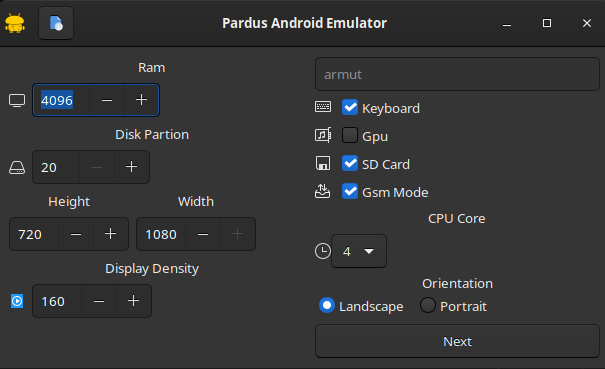
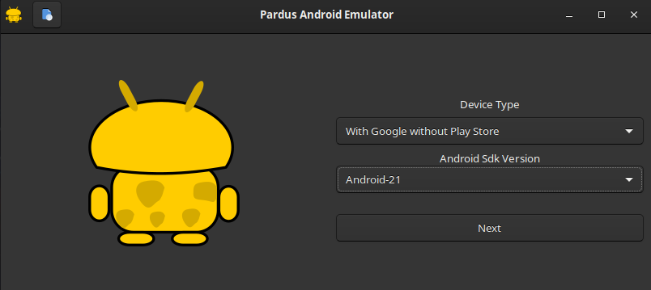

# Pardus Android Emulator

Yo can:
- Generate an Android Emulator,
- Edit it,
- Delete it,
- Chose its sdk
- with google or google and playstore or without google and playstore

## Dependencies

`sudo apt install adb`

`pip install -r requirements.txt`

# Runnig

`python3 main.py`