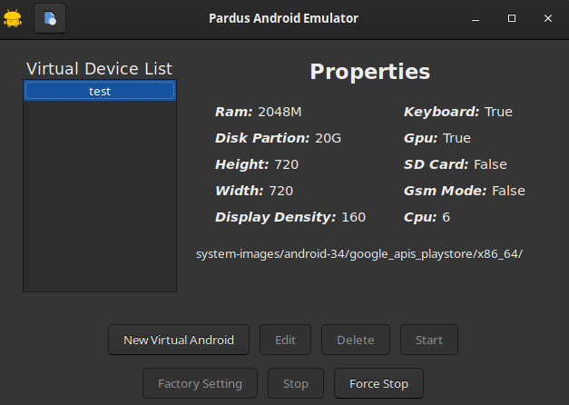
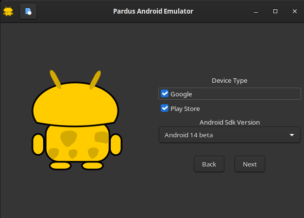

# Pardus Android Emulator

You can:
- Generate an Android Emulator,
- Edit it,
- Delete it,
- Chose its sdk
- with google or google and playstore or without google and playstore







## Dependencies

`pip install -r requirements.txt`

# Running

`python3 Main.py`

# Building

```console
sudo apt install devscripts git-buildpackage
sudo mk-build-deps -ir
gbp buildpackage --git-export-dir=/tmp/build/pardus-android-emulator -us -uc --git-ignore-branch --git-ignore-new

```

# License

This application is published under the GPL-3.0 license , but you have to accept the google terms of use while installing the android emulator in the application.
